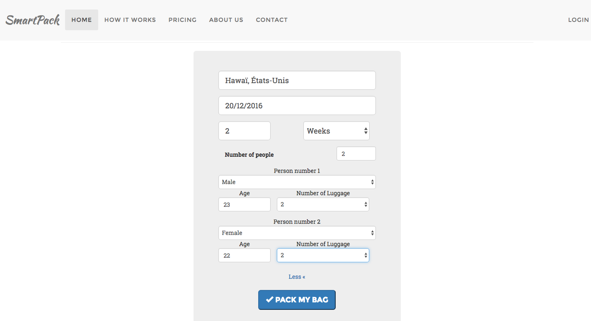
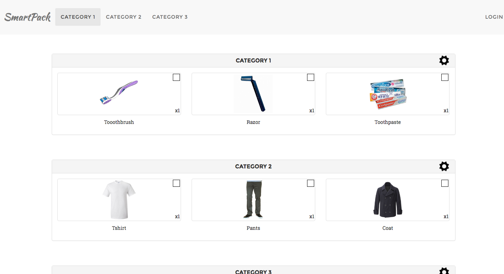

# README #

## What it is

SmartPack is a project for a Web Interface class at Eurecom in Fall 2014.
It is the front-end of an app that helps you pack your bag before going on a trip.
Technologies used included Angular 1 and Bootstrap.

## ScreenShots
Fill the details of your trip

And a list of items is suggested

